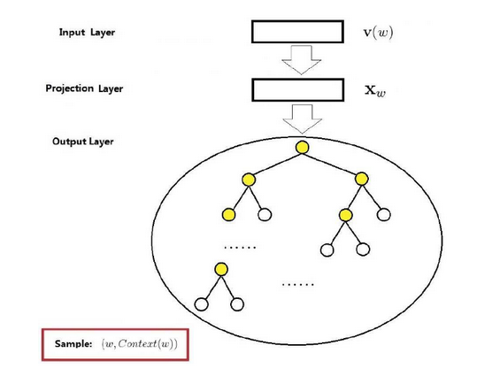

Attention

 Github不渲染公式，文中有数学公式，为了正常显示公式，在chrome的扩展程序中，打开chrome网上应用店，然后搜索MathJax Plugin for Github，下载该插件，并且启用，就可以让上述公式正常显示。

## 1 & 2 Word Vectors and Word Senses

什么是词向量/词嵌入：词向量（word embedding）是一个固定长度的实值向量,词向量是神经语言模型的副产品,词向量是针对“词”提出的。事实上，也可以针对更细或更粗的粒度来进行推广——比如字向量、句向量、文档向量等.

### one-hot向量

如果总单词数是 n，那么每个单词可以转换成一个 n 维 One-Hot 向量，文本转换成矩阵。

缺点：1、词表多大，向量维度过大；2、不能表示相似性：孤立了每个词，对相关词的泛化能力不强。


### 特征表示向量（词嵌入）

词汇表中每个词表示为一个固定长度的向量，词嵌入意思是把词嵌入到一个固定维度的高维空间。

向量之间的距离（余弦相似度）表示词的相似性。

余弦相似度：
$$
sim(u,v) = \frac{u^Tv}{||u||_2 ||v||_2}
$$
用降维算法TSNE将高维词向量转换为二维，就可以可视化词的相似性。

优势：相比One-Hot维度低，可以表示相似性。


### 嵌入矩阵

词典中所有的词的词嵌入向量构成的矩阵E。

第j个词的词嵌入：$e_j=E O_j$ 


### Word vectors

Word2Vec 本质上也是一个神经语言模型，但是它的目标并不是语言模型本身，而是词向量；因此，其所作的一系列优化，都是为了更快更好的得到词向量。


word vectors最初的一些Idea:

1、大量的文本数据

2、每一个词都可以用一个固定的向量表示

3、给出t时刻，c为中心词，o为上下文词

4、可以通过计算c与o相似性，来给出c与o的概率

5、不断调整词向量来最大化概率


目标函数：在t位置，我们给定中心词$w_{j}$，以及窗口大小m，预测上下文词，$\theta$是我们待优化。我们将$L(\theta)$写成loss函数形式，最小化目标函数即最大化词向量精度。


我们想最小化损失函数$J(\theta)=-\frac{1}{T} \sum_{t=1}^{T} \sum_{-m \leq j \leq m \atop j \neq 0} \log P\left(w_{t+j} | w_{t} ; \theta\right)$,那么我们要计算$P\left(w_{t+j} | w_{t} ; \theta\right)$,我们引入softmax函数。

中心词c和上下文词o,输入上下文词的词嵌入，经过 Softmax 层，输出目标词是每个词的概率。
$$
P(o | c)=\frac{\exp \left(u_{o}^{T} v_{c}\right)}{\sum_{w \in V} \exp \left(u_{w}^{T} v_{c}\right)}
$$
损失函数：更大点积=更大的相似度


随机梯度下降SGD:

问题：$J(\theta)$是语料库中所有窗口的函数,$\nabla_{\theta} J(\theta)$的计算代价是十分大的，进行一次梯度更新的时间也是很大的，我们可以采用SGD,在每个窗口进行梯队更新。我们每次仅更新2m+1个词的梯度,$\nabla_{\theta} J(\theta)$是稀疏的。


随机梯度与词向量：

我们只更新实际出现的词向量，更新特定行中的嵌入矩阵U和V。

如果有数百万个字向量，并且进行分布式计算，那么需要大量的更新，更新的矩阵是稀疏的，所以只更新实际出现的词向量。


Word2Vec 提供了两套模型：CBOW 和 Skip-Gram(SG)

- CBOW 在已知 `context(w)` 的情况下，预测 `w`
- SG 在已知 `w` 的情况下预测 `context(w)`

从训练集的构建方式可以更好的理解和区别 **CBOW** 和 **SG** 模型

- 每个训练样本为一个二元组 `(x, y)`，其中 `x`为特征，`y`为标签

  假设上下文窗口的大小 `context_window =5`，即

  

  或者说 `skip_window = 2`，有 `context_window = skip_window*2 + 1`

- CBOW 的训练样本为：

- 

  

  

  使用分级的分类树，每个结点是一个Sigmoid二分类器，计算成本与词汇表大小的对数成正比，而不是词汇表大小的线性函数。分类树通常是哈夫曼树(最优二叉树)。

  

- SG 的训练样本为：

  抽取上下文与目标词配对，来构造一个监督学习问题。多分类。目标词是从上下文词的前后5个或者10个词距中随机选择的。输入上下文词的词嵌入，经过 Softmax 层，输出目标词是每个词的概率。

  分母的计算代价是较大的，采用负采样
  $$
  P(o | c)=\frac{\exp \left(u_{o}^{T} v_{c}\right)}{\sum_{w \in V} \exp \left(u_{w}^{T} v_{c}\right)}
  $$
  

  

- 一般来说，`skip_window <= 10`

基于负采样的Skip-gram

Skip-gram给定`(w,context(w))`,给定`w`，context(w)为它的正样本，而其他词为他的负样本，如果不使用负采样，即 N-gram 神经语言模型中的做法，就是对整个词表 Softmax 和交叉熵，负采样相当于选取所有负例中的一部分作为负样本，从而减少计算量。

监督学习问题：给定一对单词（中心词与上下文词）与噪声单词对（负样本），预测这是否是一对上下文词-目标词。问题转化为二分类。
$$
P(y=1|c,t)=\sigma (\theta_{t}^{T} e_{c})
$$
目标函数（最小化）：
$$
J_{t}(\theta)=\log \sigma\left(u_{o}^{T} v_{c}\right)+\sum_{i=1}^{k} \mathbb{E}_{j \sim P(w)}\left[\log \sigma\left(-u_{j}^{T} v_{c}\right)\right]
$$
最大化
$$
J_{n e g-s a m p l e}\left(\boldsymbol{o}, \boldsymbol{v}_{c}, \boldsymbol{U}\right)=-\log \left(\sigma\left(\boldsymbol{u}_{o}^{\top} \boldsymbol{v}_{c}\right)\right)-\sum_{k=1}^{K} \log \left(\sigma\left(-\boldsymbol{u}_{k}^{\top} \boldsymbol{v}_{c}\right)\right)
$$
负样本：选定上下文词后，随机从词典中选择一个词作为目标词。一个上下文词对应一个正样本和k个负样本。

小数据集：k = 5-20

大数据集：k = 2-5

每个词作为目标词的概率为
$$
P(w_i) = \frac{f(w_i)^{3/4}}{\sum f(w_i)^{3/4}}
$$
其中，$f(w_i)$ 表示词 $w_i$ 在语料库中出现的频率。使频率较低的单词被更频繁地采样。


### GloVe

基于共现矩阵的GloVe两种实现方式：

基于文档 - LSA 模型（SVD分解），捕捉潜在语义分词

基于窗口 - 类似 word2vec,使用窗口以及周围的词，捕捉语法（POS）和语义信息。


基于窗口的共现矩阵


存在问题：1、词表不断增大，词表维数增大，存储空间增大，模型稀疏性，没有鲁棒性

共现矩阵的SVD分解，将X变为$U \Sigma V^{\top}$,其中U和V正交，保留k个奇异值，实现降维。


功能词的处理:

功能词：如 "the", "he", "has", ...

法1：直接忽略 

法2：设置阈值  min（x,t）,其中 `x` 为功能词语其他词的共现次数，`t` 为设置的阈值

可以尝试使用一些方法代替单纯的计数，如**皮尔逊相关系数**，负数记为 0 


GloVe 模型的是基于共现矩阵构建的,GloVe 认为共现矩阵可以通过一些统计信息得到词之间的关系，这些关系可以一定程度上表达词的含义.


- **solid** related to **ice** but not **steam**
- **gas** related to **stream** but not **ice**
- **water** related to both
- **fashion** relate not to both

假设词向量已知，如果这些词向量通过**某个函数**（目标函数）可以**拟合**共现矩阵中的统计信息，那么可以认为这些词向量也拥有了共现矩阵中蕴含的语义,模型的训练过程就是拟合词向量的过程。

目标函数：


$w_{i}$与$w_{j}$为词向量，$x_{i,j}$为$w_{i}$与$w_{j}$共现出现次数，f(x)为权值函数，防止$x_{i,j}$=0与高频词出现。


## 6 Language models and RNNs

###  语言模型

​     假如我们输入一些文本$x^{(1)}$,...,$x^{(T)}$，那么语言概率模型为：
$$
\begin{aligned} P\left(\boldsymbol{x}^{(1)}, \ldots, \boldsymbol{x}^{(T)}\right) &=P\left(\boldsymbol{x}^{(1)}\right) \times P\left(\boldsymbol{x}^{(2)} | \boldsymbol{x}^{(1)}\right) \times \cdots \times P\left(\boldsymbol{x}^{(T)} | \boldsymbol{x}^{(T-1)}, \ldots, \boldsymbol{x}^{(1)}\right) \\ &=\prod_{t=1}^{T} P\left(\boldsymbol{x}^{(t)} | \boldsymbol{x}^{(t-1)}, \ldots, \boldsymbol{x}^{(1)}\right) \end{aligned}
$$


### n-gram 语言模型

unigrams: the, students,opened, their·
bigrams: the students, students opened, opened their
trigrams: the students opened, students opened their
4-grams: the students opened their

n-gram 语言模型假设：$x^{(t+1)}$仅依赖于之前n-1个单词，

假设：

​                                  $$P\left(\boldsymbol{x}^{(t+1)} | \boldsymbol{x}^{(t)}, \ldots, \boldsymbol{x}^{(1)}\right)=P\left(\boldsymbol{x}^{(t+1)} | \boldsymbol{x}^{(t)}, \ldots, \boldsymbol{x}^{(t-n+2)}\right)$$

条件命题概率：


统计近似：
$$
\approx \frac{\operatorname{count}\left(\boldsymbol{x}^{(t+1)}, \boldsymbol{x}^{(t)}, \ldots, \boldsymbol{x}^{(t-n+2)}\right)}{\operatorname{count}\left(\boldsymbol{x}^{(t)}, \ldots, \boldsymbol{x}^{(t-n+2)}\right)}
$$

### 神经语言模型

输入：序列化单词$x^{(1)}$,$x^{(2)}$,...,$x^{(t)}$

输出：预测一下个单词概率分布$P\left(\boldsymbol{x}^{(t+1)} | \boldsymbol{x}^{(t)}, \ldots, \boldsymbol{x}^{(1)}\right)$


#### 固定窗口的神经语言模型


相比n-gram模型改进

1、没有稀疏化问题

2、不用保存全部的n-gram信息

存在问题

1、$x^{(1)}$与$x^{(2)}$与不同权值矩阵W相乘，输入不对称，不能解决边长输入的问题。

2、扩大固定窗口，扩大权值矩阵W

3、固定窗口大小不够


#### RNN语言模型


RNN优点

1、可以解决边长输入问题

2、T时刻可以得到来自T-1时刻之前信息

3、输入长短不会影响模型大小

4、在T时刻，权值矩阵值相同

RNN语言模型存在梯度消失问题,变体RNN语言模型

LSTM

GRU

multi-layer

bidirection

##### 训练RNN语言模型

序列单词（平行语料库）$x^{(1)}$,...,$x^{(T)}$

RNN-LM输出分布：$\hat{\boldsymbol{y}}^{(t)}$

交叉熵损失函数


$$
J^{(t)}(\theta)=C E\left(\boldsymbol{y}^{(t)}, \hat{\boldsymbol{y}}^{(t)}\right)=-\sum_{w \in V} \boldsymbol{y}_{w}^{(t)} \log \hat{\boldsymbol{y}}_{w}^{(t)}=-\log \hat{\boldsymbol{y}}_{\boldsymbol{x}_{t+1}}^{(t)}
$$
平均交叉熵损失函数


$$
J(\theta)=\frac{1}{T} \sum_{t=1}^{T} J^{(t)}(\theta)=\frac{1}{T} \sum_{t=1}^{T}-\log \hat{\boldsymbol{y}}_{\boldsymbol{x}_{t+1}^{(t)}}
$$


##### 反向传播梯度更新

$$
\frac{\partial J^{(t)}}{\partial \boldsymbol{W}_{\boldsymbol{h}}}=\left.\sum_{i=1}^{t} \frac{\partial J^{(t)}}{\partial \boldsymbol{W}_{\boldsymbol{h}}}\right|_{(i)}
$$


### 评估语言模型


语言模型评价指标困惑度perplexity，语言模型越好，下一个词预测概率越大，困惑度越小
$$
\text { perplexity }=\prod_{t=1}^{T}\left(\frac{1}{P_{\mathrm{LM}}\left(\boldsymbol{x}^{(t+1)} | \boldsymbol{x}^{(t)}, \ldots, \boldsymbol{x}^{(1)}\right)}\right)^{1 / T}
$$
等价于交叉熵损失指数函数

​                                  
$$
\prod_{t=1}^{T}\left(\frac{1}{\hat{\boldsymbol{y}}_{\boldsymbol{x}_{t+1}}^{(t)}}\right)^{1 / T}=\exp \left(\frac{1}{T} \sum_{t=1}^{T}-\log \hat{\boldsymbol{y}}_{\boldsymbol{x}_{t+1}}^{(t)}\right)=\exp (J(\theta))
$$


### 语言模型任务

预测输入、语音识别、手写识别、拼写/语法修正、身份识别、机器翻译、摘要、对话


语言识别


句子预测分类：


问答：


## 7.Vanishing Gradients and Fancy RNNs


### GRU（门控循环单元）

当从左到右扫描序列的时候，由门来决定，是否更新某个记忆细胞；一直保留记忆细胞的值不变，直到需要使用记忆细胞的时候，之后才更新记忆细胞的值。


完整的 GRU：


优点：更简单，计算速度更快，能够构造更大规模的网络

### LSTM

通过遗忘门、更新门、输出门三个门来控制，LSTM 能够把浅层的记忆细胞一直向下传递

序列输入$x^{(t)}$,计算隐层状态$h^{(t)}$,cell states状态 $c^{(t)}$,在t时刻


上述公式表示如下图


### 双向 RNN(Bidirectional RNNs)

同时具有正向 RNN 和反向 RNN，每个时间步都计算一个正向的激活值和一个反向的激活值，通过这两个激活值来计算输出。

双向 LSTM 常用于 NLP 中。其可以获得单词terribly上下文相关信息


在t时刻，其计算公式


Bert通过双向的encoder transformer通过预训练表示上下文信息


### 多层RNN(Multi-layer RNNs)

高级性能的RNN一般是多层的，比如Bert就可达24层


### 梯度爆炸（exploding gradient）与梯度消失（Vanishing gradient）

链式求导
$$
\frac{\partial J^{(4)}}{\partial \boldsymbol{h}^{(1)}}=\frac{\partial \boldsymbol{h}^{(2)}}{\partial \boldsymbol{h}^{(1)}} \times \quad \frac{\partial \boldsymbol{h}^{(3)}}{\partial \boldsymbol{h}^{(2)}} \times \quad \frac{\partial \boldsymbol{h}^{(4)}}{\partial \boldsymbol{h}^{(3)}} \times \frac{\partial J^{(4)}}{\partial \boldsymbol{h}^{(4)}}
$$


在深度神经网络中的梯度是不稳定的，在前面的层中或会消失，或会激增。这种不稳定性才是深度神经网络中基于梯度学习的根本问题。

梯度爆炸：当每一层梯度与权重的乘积大于 1 时，由于链式求导，浅层的参数梯度会变得很大，导致参数指数级增长，参数可能数值溢出。
$$
\theta^{n e w}=\theta^{o l d}-\stackrel{\sim}{\alpha} \underbrace{\nabla_{\theta} J(\theta)}_{\text {gradient }}
$$
解决办法：

1. 梯度修剪：更新参数的时候，当梯度大于某个阈值，缩放梯度向量。

   

2. 权重正则化：l1 正则，l2 正则。

   

梯度消失：当每一层梯度与权重的乘积小于 1 时，由于链式求导，浅层的参数梯度会变得很小，导致参数指数级减小，参数变化很慢。


解决办法：

1.不用 Sigmoid 激活函数，用 relu,权重初始化

```python
# relu激活函数
W[l] = np.random.randn(shape) * np.sqrt(2/n[l-1])
# tanh激活函数
W[l] = np.random.randn(shape) * np.sqrt(1/n[l-1])
W[l] = np.random.randn(shape) * np.sqrt(2/(n[l-1] * n[l]))
```

2.skip/dense connections.

残差相连：普通网络加上跳远连接，构成残差块，就变成了残差网络。

跳远连接（skip connection）：隐层的输出跳过中间的层，将信息传递到网络的更深层；在更深层的激活函数的输入加上浅层的输出；这几层共同构成了一个残差块。
$$
a^{[l+2]} = g(z^{[l+2]} + a^{[l]})
$$


dense connections：


### 梯度检验

梯度的数值逼近(采用双边差)：
$$
f'(x_{0}) \approx \frac {f(x_{0}+\epsilon)-f(x_{0}-\epsilon)} {2\epsilon} \\
逼近误差：O(\epsilon ^{2})
$$
梯度检验：
$$
\begin{align}
&令\epsilon=10^{-7} \\
&\theta^{[i]} = (W^{[i]}, b^{[i]})\\
&for \quad each \quad i: \\
&d\theta _{approx}^{[i]} = \frac{J(\theta^{[1]},\theta^{[2]},...,\theta^{[i]}+\epsilon)-J(\theta^{[1]},\theta^{[2]},...,\theta^{[i]}-\epsilon)} {2\epsilon} \\
&check \quad \frac{||d\theta _{approx}^{[i]}-d\theta^{[i]} ||_{2}}
{||d\theta _{approx}^{[i]}||_{2}+||d\theta^{[i]} ||_{2}} \approx 10^{-7}
\end{align}
$$
梯度检验使用说明：

1. 不要用在训练中——梯度检验只用于调试；
2. 如果梯度检验失败，查看具体的项来找到梯度计算的bug；
3. 代价函数计算不要忘记正则项；
4. 不要与dropout同时使用


## 11.Convolutional Networks for NLP

### CNN简介

#### Padding

n×n 的图像，f×f 的过滤器，卷积得到 (n-f+1)×(n-f+1) 的图像。
缺点：每次卷积操作，图像会缩小；会丢失图像边缘的信息
Padding：卷积前，在图像周围填充一圈 0.
填充方式 valid 和 same
valid：不填充
same：卷积前填充，使得卷积后图像大小和卷积前相同。
$$
p= \frac{f-1}{2}
$$

#### 步长

n×n 的图像，f×f 的过滤器，padding p, stride s, 卷积得到的图像大小为：
$$
\left \lfloor \frac {n+2p-f}{s} + 1\right \rfloor \times \left \lfloor \frac {n+2p-f}{s} + 1 \right \rfloor
$$
输入图像和过滤器的通道数必须相等，输出图像没有通道数。
卷积层中的单元数，等于过滤器个数，等于这一层的特征数，等于特征表示的个数。
参数数量少，避免过拟合

卷积符号

如果层 l 是卷积层：
$$
\begin{align}
&f^{[l]} = \text{filter size}\\
&p^{[l]} = \text{padding }\\
&s^{[l]} = \text {stride} \\
&n^{[l]}_c = \text {number of filters} \\
&\text {Each filter is: } f^{[l]} \times f^{[l]} \times n^{[l-1]}_c \\
&\text {Activation: } a^{[l]} \rightarrow n^{[l-1]}_H \times n^{[l-1]}_W \times n^{[l-1]}_c\\
&\text {Weight: } f^{[l]} \times f^{[l]} \times n^{[l-1]}_c \times n^{[l]}_c\\
&\text {bias: } 1 \times 1 \times 1 \times n^{[l]}_c\\ \\
&\text {Input: } n^{[l-1]}_H \times n^{[l-1]}_W \times n^{[l-1]}_c\\
&\text {Output: } n^{[l]}_H \times n^{[l]}_W \times n^{[l]}_c\\
&n^{[l]}_H = \left \lfloor \frac {n^{[l-1]}_H + 2p^{[l]}-f^{[l]}}{s^{[l]}} + 1\right \rfloor
\end{align}
$$
图像的**高度和宽度**会随着网络深度的增加不断减小，通道数量不断增加

#### 池化层

使用池化层减小特征表示的大小，加速计算，同时提高提取特征的鲁棒性。
意义：如果区域提取到某种特征，就取其最大值。
每个通道单独执行池化
池化层的超参数是 f=2 和 s=2，池化方式（最大/平均池化）

卷积层的意义

参数共享：一个特征探测器可以重复使用在图像的每个部分
稀疏连接：卷积层的每个单元的输出仅与部分输入有关

经典卷积网络

#### LeNet-5


使用的激活函数是 sigmoid 和 tanh，使用了平均池化

#### AlexNet


使用的激活函数是 Relu。
~~使用了 LRN（局部响应归一化）~~


#### VGG-16


固定了卷积层和池化层的大部分超参数：
CONV=3×3 filter, s=1, same    MAX-POOL=2×2, s=2
简化了神经网络结构。
包含了 16 个卷积层和全连接层，1.38 亿个参数，
规律：每次卷积的过滤器个数翻倍，每次池化图像的尺寸缩小二分之一。


#### 残差网络（ResNet） 

残差网络：普通网络加上跳远连接，构成残差块，就变成了残差网络。
跳远连接（skip connection）：隐层的输出跳过中间的层，将信息传递到网络的更深层；在更深层的激活函数的输入加上浅层的输出；这几层共同构成了一个残差块。
$$
a^{[l+2]} = g(z^{[l+2]} + a^{[l]})
$$
意义：普通深度网络，随着深度的加深，训练误差会增大，因为梯度消失和梯度爆炸；残差网络会避免这种情况。


#### 1×1 卷积

相当于在图像上同一个位置跨 channel 进行全连接
用来压缩信道数量
构建瓶颈层，缩减表示规模，减少计算成本


#### Inception 网络

代替人工来确定卷积层中的过滤器类型，是否创建卷积层或者池化层；
应用各种类型的过滤器，使输出的高和宽相同，然后把通道连起来

./img/

### 由RNN到CNN

对于文本一维卷积 


带池化的一维卷积：


带池化3通道一维卷积：


最大池化3通道一维卷积：


平均池化3通道一维卷积：


stride=2:


局部最大池化，stride=2:


k-max k=2


### 单层CNN用于句子分类

卷积+池化

词向量：$\mathbf{x}_{i} \in \mathbb{R}^{k}$    k为词向量维度

句子：$\mathbf{x}_{1 : n}=\mathbf{x}_{1} \oplus x_{2} \oplus \cdots \oplus \mathbf{x}_{n}$      （词向量拼接组成句向量）

词向量连接：$\mathbf{X}_{i : i+j}$                                 

卷积核：$\mathbf{w} \in \mathbb{R}^{h k}$

卷积核为向量，大小可以为2/3/4等


对于单通道CNN计算feature:
$$
c_{i}=f\left(\mathbf{w}^{T} \mathbf{x}_{i : i+h-1}+b\right)
$$
输入句子：
$$
\mathbf{x}_{1 : n}=\mathbf{x}_{1} \oplus \mathbf{x}_{2} \oplus \ldots \oplus \mathbf{x}_{n}
$$
窗口大小h：
$$
\left\{\mathbf{x}_{1 : h}, \mathbf{x}_{2 : h+1}, \ldots, \mathbf{x}_{n-h+1 : n}\right\}
$$
feature map：
$$
\mathbf{c}=\left[c_{1}, c_{2}, \dots, c_{n-h+1}\right] \in \mathbb{R}^{n-h+1}
$$
最大池化：
$$
\hat{c}=\max \{\mathbf{c}\}
$$
最终特征：（卷积核大小为3,4,5，每个100个feature map）
$$
\mathbf{z}=\left[\hat{c}_{1}, \ldots, \hat{c}_{m}\right]
$$
分类输出：
$$
y=\operatorname{softmax}\left(W^{(S)} z+b\right)
$$


论文中超参数设置：

非线性：ReLU

卷积核大小：3,4,5  （100 feature map）

Dropout p=0.5

SGD Minibatcb size:50

word2vec:k=300


### CNN应用翻译

encoding:CNN

decoding:RNN


Character-Aware Neural Language Models

基于字符级词嵌入，利用卷积、LSTM


Very Deep Convolutional Networks for Text Classification

将图像中深层次网络应用到NLP中


## 13.Contextual Word Embeddings

词的表示方法：

Wordvec、Glove、fastText

最简单和常见的解决方案：
训练：{词频>=5} U {<UNK>}，{词频<5} ，训练为一个统一词向量
预测：使用<UNK>表示OOV
问题：不同的OOV表示含义不同，无法区分不同的UNK词


复杂的词向量训练方法：

a.如果<UNK>字在测试时出现，在测试时使用该<UNK>向量。
b.其他词，随机初始化词向量


#### TagLM-"Pre-ELMo"


#### ELMO

#### ULMfit

Universal Language Model Fine-tuning for Text Classification


#### GPT/GPT2

#### Transformer

#### BERT

