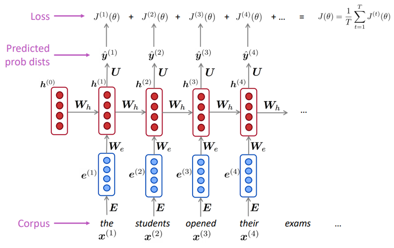
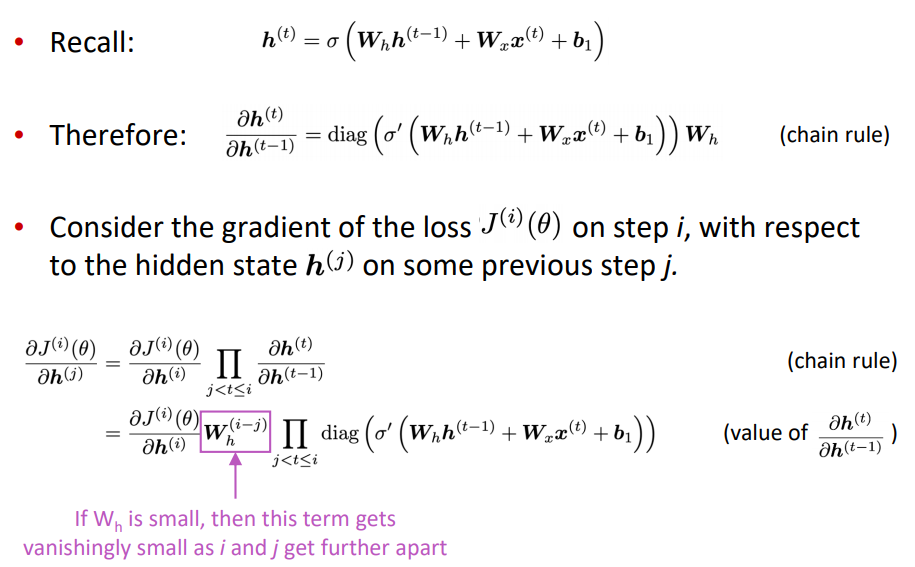

Attention

 Github不渲染公式，文中有数学公式，为了正常显示公式，在chrome的扩展程序中，打开chrome网上应用店，然后搜索MathJax Plugin for Github，下载该插件，并且启用，就可以让上述公式正常显示。


## 6 Language models and RNNs

###  语言模型

​     假如我们输入一些文本$x^{(1)}$,...,$x^{(T)}$，那么语言概率模型为：
$$
\begin{aligned} P\left(\boldsymbol{x}^{(1)}, \ldots, \boldsymbol{x}^{(T)}\right) &=P\left(\boldsymbol{x}^{(1)}\right) \times P\left(\boldsymbol{x}^{(2)} | \boldsymbol{x}^{(1)}\right) \times \cdots \times P\left(\boldsymbol{x}^{(T)} | \boldsymbol{x}^{(T-1)}, \ldots, \boldsymbol{x}^{(1)}\right) \\ &=\prod_{t=1}^{T} P\left(\boldsymbol{x}^{(t)} | \boldsymbol{x}^{(t-1)}, \ldots, \boldsymbol{x}^{(1)}\right) \end{aligned}
$$


### n-gram 语言模型

unigrams: the, students,opened, their·
bigrams: the students, students opened, opened their
trigrams: the students opened, students opened their
4-grams: the students opened their

n-gram 语言模型假设：$x^{(t+1)}$仅依赖于之前n-1个单词，

假设：

​                                  $$P\left(\boldsymbol{x}^{(t+1)} | \boldsymbol{x}^{(t)}, \ldots, \boldsymbol{x}^{(1)}\right)=P\left(\boldsymbol{x}^{(t+1)} | \boldsymbol{x}^{(t)}, \ldots, \boldsymbol{x}^{(t-n+2)}\right)$$

条件命题概率：


统计近似：
$$
\approx \frac{\operatorname{count}\left(\boldsymbol{x}^{(t+1)}, \boldsymbol{x}^{(t)}, \ldots, \boldsymbol{x}^{(t-n+2)}\right)}{\operatorname{count}\left(\boldsymbol{x}^{(t)}, \ldots, \boldsymbol{x}^{(t-n+2)}\right)}
$$

### 神经语言模型

输入：序列化单词$x^{(1)}$,$x^{(2)}$,...,$x^{(t)}$

输出：预测一下个单词概率分布$P\left(\boldsymbol{x}^{(t+1)} | \boldsymbol{x}^{(t)}, \ldots, \boldsymbol{x}^{(1)}\right)$


#### 固定窗口的神经语言模型


相比n-gram模型改进

1、没有稀疏化问题

2、不用保存全部的n-gram信息

存在问题

1、$x^{(1)}$与$x^{(2)}$与不同权值矩阵W相乘，输入不对称，不能解决边长输入的问题。

2、扩大固定窗口，扩大权值矩阵W

3、固定窗口大小不够


#### RNN语言模型


RNN优点

1、可以解决边长输入问题

2、T时刻可以得到来自T-1时刻之前信息

3、输入长短不会影响模型大小

4、在T时刻，权值矩阵值相同

RNN语言模型存在梯度消失问题,变体RNN语言模型

LSTM

GRU

multi-layer

bidirection

##### 训练RNN语言模型

序列单词（平行语料库）$x^{(1)}$,...,$x^{(T)}$

RNN-LM输出分布：$\hat{\boldsymbol{y}}^{(t)}$

交叉熵损失函数


$$
J^{(t)}(\theta)=C E\left(\boldsymbol{y}^{(t)}, \hat{\boldsymbol{y}}^{(t)}\right)=-\sum_{w \in V} \boldsymbol{y}_{w}^{(t)} \log \hat{\boldsymbol{y}}_{w}^{(t)}=-\log \hat{\boldsymbol{y}}_{\boldsymbol{x}_{t+1}}^{(t)}
$$
平均交叉熵损失函数


$$
J(\theta)=\frac{1}{T} \sum_{t=1}^{T} J^{(t)}(\theta)=\frac{1}{T} \sum_{t=1}^{T}-\log \hat{\boldsymbol{y}}_{\boldsymbol{x}_{t+1}^{(t)}}
$$


##### 反向传播梯度更新

$$
\frac{\partial J^{(t)}}{\partial \boldsymbol{W}_{\boldsymbol{h}}}=\left.\sum_{i=1}^{t} \frac{\partial J^{(t)}}{\partial \boldsymbol{W}_{\boldsymbol{h}}}\right|_{(i)}
$$


### 评估语言模型


语言模型评价指标困惑度perplexity，语言模型越好，下一个词预测概率越大，困惑度越小
$$
\text { perplexity }=\prod_{t=1}^{T}\left(\frac{1}{P_{\mathrm{LM}}\left(\boldsymbol{x}^{(t+1)} | \boldsymbol{x}^{(t)}, \ldots, \boldsymbol{x}^{(1)}\right)}\right)^{1 / T}
$$
等价于交叉熵损失指数函数

​                                  
$$
\prod_{t=1}^{T}\left(\frac{1}{\hat{\boldsymbol{y}}_{\boldsymbol{x}_{t+1}}^{(t)}}\right)^{1 / T}=\exp \left(\frac{1}{T} \sum_{t=1}^{T}-\log \hat{\boldsymbol{y}}_{\boldsymbol{x}_{t+1}}^{(t)}\right)=\exp (J(\theta))
$$


### 语言模型任务

预测输入、语音识别、手写识别、拼写/语法修正、身份识别、机器翻译、摘要、对话


语言识别


句子预测分类：


问答：


## 7.Vanishing Gradients and Fancy RNNs


### GRU（门控循环单元）

当从左到右扫描序列的时候，由门来决定，是否更新某个记忆细胞；一直保留记忆细胞的值不变，直到需要使用记忆细胞的时候，之后才更新记忆细胞的值。


完整的 GRU：


优点：更简单，计算速度更快，能够构造更大规模的网络

### LSTM

通过遗忘门、更新门、输出门三个门来控制，LSTM 能够把浅层的记忆细胞一直向下传递

序列输入$x^{(t)}$,计算隐层状态$h^{(t)}$,cell states状态 $c^{(t)}$,在t时刻


上述公式表示如下图


### 双向 RNN(Bidirectional RNNs)

同时具有正向 RNN 和反向 RNN，每个时间步都计算一个正向的激活值和一个反向的激活值，通过这两个激活值来计算输出。

双向 LSTM 常用于 NLP 中。其可以获得单词terribly上下文相关信息


在t时刻，其计算公式


Bert通过双向的encoder transformer通过预训练表示上下文信息


### 多层RNN(Multi-layer RNNs)

高级性能的RNN一般是多层的，比如Bert就可达24层


### 梯度爆炸（exploding gradient）与梯度消失（Vanishing gradient）

链式求导
$$
\frac{\partial J^{(4)}}{\partial \boldsymbol{h}^{(1)}}=\frac{\partial \boldsymbol{h}^{(2)}}{\partial \boldsymbol{h}^{(1)}} \times \quad \frac{\partial \boldsymbol{h}^{(3)}}{\partial \boldsymbol{h}^{(2)}} \times \quad \frac{\partial \boldsymbol{h}^{(4)}}{\partial \boldsymbol{h}^{(3)}} \times \frac{\partial J^{(4)}}{\partial \boldsymbol{h}^{(4)}}
$$


在深度神经网络中的梯度是不稳定的，在前面的层中或会消失，或会激增。这种不稳定性才是深度神经网络中基于梯度学习的根本问题。

梯度爆炸：当每一层梯度与权重的乘积大于 1 时，由于链式求导，浅层的参数梯度会变得很大，导致参数指数级增长，参数可能数值溢出。
$$
\theta^{n e w}=\theta^{o l d}-\stackrel{\sim}{\alpha} \underbrace{\nabla_{\theta} J(\theta)}_{\text {gradient }}
$$
解决办法：

1. 梯度修剪：更新参数的时候，当梯度大于某个阈值，缩放梯度向量。

   

2. 权重正则化：l1 正则，l2 正则。

   

梯度消失：当每一层梯度与权重的乘积小于 1 时，由于链式求导，浅层的参数梯度会变得很小，导致参数指数级减小，参数变化很慢。




解决办法：

1.不用 Sigmoid 激活函数，用 relu,权重初始化

```python
# relu激活函数
W[l] = np.random.randn(shape) * np.sqrt(2/n[l-1])
# tanh激活函数
W[l] = np.random.randn(shape) * np.sqrt(1/n[l-1])
W[l] = np.random.randn(shape) * np.sqrt(2/(n[l-1] * n[l]))
```

2.skip/dense connections.

残差相连：普通网络加上跳远连接，构成残差块，就变成了残差网络。

跳远连接（skip connection）：隐层的输出跳过中间的层，将信息传递到网络的更深层；在更深层的激活函数的输入加上浅层的输出；这几层共同构成了一个残差块。
$$
a^{[l+2]} = g(z^{[l+2]} + a^{[l]})
$$


dense connections：


### 梯度检验

梯度的数值逼近(采用双边差)：
$$
f'(x_{0}) \approx \frac {f(x_{0}+\epsilon)-f(x_{0}-\epsilon)} {2\epsilon} \\
逼近误差：O(\epsilon ^{2})
$$
梯度检验：
$$
\begin{align}
&令\epsilon=10^{-7} \\
&\theta^{[i]} = (W^{[i]}, b^{[i]})\\
&for \quad each \quad i: \\
&d\theta _{approx}^{[i]} = \frac{J(\theta^{[1]},\theta^{[2]},...,\theta^{[i]}+\epsilon)-J(\theta^{[1]},\theta^{[2]},...,\theta^{[i]}-\epsilon)} {2\epsilon} \\
&check \quad \frac{||d\theta _{approx}^{[i]}-d\theta^{[i]} ||_{2}}
{||d\theta _{approx}^{[i]}||_{2}+||d\theta^{[i]} ||_{2}} \approx 10^{-7}
\end{align}
$$
梯度检验使用说明：

1. 不要用在训练中——梯度检验只用于调试；
2. 如果梯度检验失败，查看具体的项来找到梯度计算的bug；
3. 代价函数计算不要忘记正则项；
4. 不要与dropout同时使用


## 13.Contextual Word Embeddings

词的表示方法：

Wordvec、Glove、fastText

最简单和常见的解决方案：
训练：{词频>=5} U {<UNK>}，{词频<5} ，训练为一个统一词向量
预测：使用<UNK>表示OOV
问题：不同的OOV表示含义不同，无法区分不同的UNK词


复杂的词向量训练方法：

a.如果<UNK>字在测试时出现，在测试时使用该<UNK>向量。
b.其他词，随机初始化词向量


#### TagLM-"Pre-ELMo"


#### ELMO

#### ULMfit

Universal Language Model Fine-tuning for Text Classification


#### GPT/GPT2

#### Transformer

#### BERT